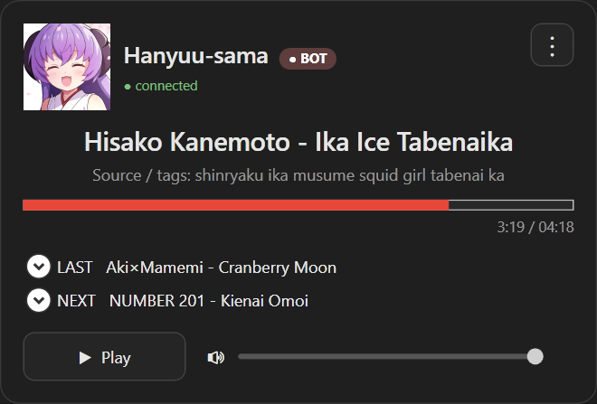

# R/a/dio Companion v1

A small native Windows desktop companion app for
[r/a/dio](https://r-a-d.io/).



R/a/dio Companion is an unofficial third-party client and is not
affiliated with, endorsed by, or an official application of r-a-d.io.

## Download

Pre-built Windows releases are available from the GitHub Releases page.

Requirements:

- Windows 10/11 (x64)
- .NET 8 Desktop Runtime

The release package includes the required VLC runtime. No separate VLC
installation is required.

Extract the archive and run `RadioCompanion.exe`.

## Features

-   Live playback from `https://relay1.r-a-d.io/main.mp3`
-   Connects to the audio stream only while playing; stopping playback
    closes the connection
-   Lightweight live metadata updates via the station SSE endpoint
-   Displays current artist/title, source/tags, DJ name and avatar
-   Handles animated GIF avatars even when the server reports them as
    `.png`
-   `LIVE` indicator for human DJs and `BOT` indicator for Hanyuu-sama
-   Non-seekable progress bar based on station timestamps
-   Click the progress bar or current track title to copy the song name
-   Click source/tags to search the first tag on Google
-   Previous and next tracks in the compact view
-   Expanded history and queue views (up to five entries each)
-   Click any history or queue item to copy it
-   App-level volume control with persistent volume and mute settings
-   Global Play/Pause and Stop media keys where supported by Windows
-   Remembers window position, volume, theme, always-on-top and
    lock-position settings
-   Optional launch on Windows startup
-   Classic, Blue and Light themes
-   Standalone audio playback using the bundled LibVLC runtime

## Building

1.  Install the Windows x64 **.NET 8 SDK**.
2.  Run `build.ps1` from PowerShell:

``` powershell
.\build.ps1
```

The published application requires the .NET 8 Desktop Runtime. VLC is
bundled with the application and does not need to be installed
separately.

## Usage notes

-   Drag any empty area of the window to move it.
-   The `⋮` menu contains window controls, startup options, themes and
    Exit.
-   Playback starts stopped when the app launches.
-   Audio playback is provided by LibVLCSharp and the bundled VLC
    runtime.

## Settings

Settings are stored at:

`%LOCALAPPDATA%\RadioCompanion\settings.json`

## Building via GitHub Actions

The repository includes a GitHub Actions workflow if you do not want to
install the SDK locally.

1.  Open the repository's **Actions** tab.
2.  Select **Build Windows app**.
3.  Choose **Run workflow**.
4.  Download the `RadioCompanion-win-x64` artifact once the build
    finishes.

## Licence and notices

R/a/dio Companion is open source software. You are free to use, modify,
adapt, and redistribute the source code according to the terms of the
licence included with this repository.

Third-party components and external content are covered by their own
licences and terms.

See:

-   `LICENSE`
-   `NOTICE.md`
